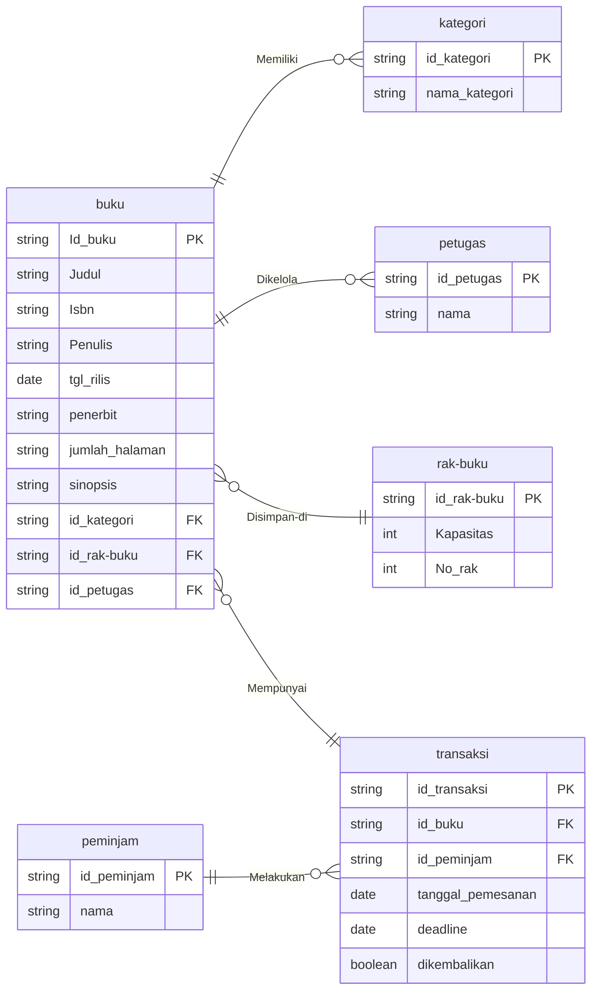

# ERD PERPUSTAKAAN

This project was created by Hosea from Koda Academy, to design a library application database using ERD with the Mermaid tool.

```mermaid

erDiagram
direction LR
    buku  ||--o{ kategori : Memiliki
    buku ||--o{ petugas : Dikelola
    buku }o--||rak-buku: Disimpan-di
    buku }o--|| transaksi : Mempunyai
    peminjam||--o{transaksi : Melakukan


    buku {
        string Id_buku PK
        string Judul
        string Isbn
        string Penulis
        date tgl_rilis
        string penerbit
        string jumlah_halaman
        string sinopsis
        string id_kategori FK
        string id_rak-buku FK
        string id_petugas FK
    }
    kategori
    kategori {
        string id_kategori PK
        string nama_kategori
    }
    rak-buku {
        string id_rak-buku PK
        int Kapasitas
        int No_rak

    }
    petugas {
        string id_petugas PK
        string nama
    }
    peminjam{
        string id_peminjam PK
        string nama
    }

    transaksi{
        string id_transaksi PK
        string id_buku FK
        string id_peminjam FK
        date tanggal_pemesanan
        date deadline
        boolean dikembalikan


    }

```
